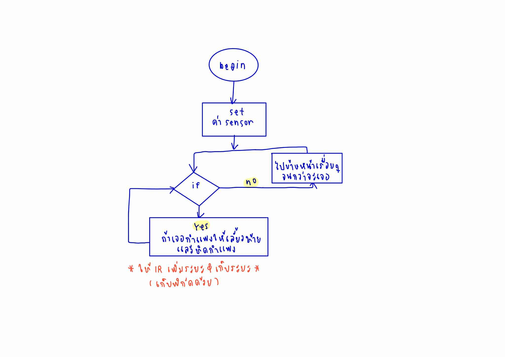

# daisy_epuck

## รายละเอียดโปรเจกต์

โปรเจกต์นี้เป็นการพัฒนา Python controller สำหรับหุ่นยนต์ e-puck ใน Webots เพื่อทดลองพฤติกรรม **Wall Following** (เดินตามกำแพง) ภายในแผนที่เขาวงกต (Maze) ขนาด 3x3 block

## Maze (เขาวงกต)

แผนที่ที่ใช้เป็นเขาวงกตขนาด 3x3 block ซึ่งมีเส้นทางและกำแพงให้หุ่นยนต์ต้องตัดสินใจเดินตามกำแพงเพื่อสำรวจหรือหาทางออก โดยหุ่นยนต์จะต้องใช้เซ็นเซอร์ตรวจจับระยะทาง (proximity sensors) เพื่อรับรู้ตำแหน่งของกำแพงรอบตัว

## พฤติกรรม (Behavior) ที่ใช้

### 1. Wall Following (เดินตามกำแพง)

- **ค้นหากำแพง:** หุ่นยนต์จะเดินหน้าตรงไปเรื่อย ๆ จนกว่าจะพบสิ่งกีดขวางด้านหน้า (ตรวจจับด้วย proximity sensor)
- **เลือกด้านที่จะตาม:** เมื่อพบกำแพง หุ่นยนต์จะเลือกเดินตามกำแพงด้านซ้ายหรือขวา โดยดูว่าฝั่งไหนมีค่าเซ็นเซอร์รวมสูงกว่า
- **เดินตามกำแพง:** ใช้ P-controller เพื่อรักษาระยะห่างจากกำแพงด้านที่เลือกไว้ (ซ้ายหรือขวา) โดยปรับความเร็วล้อซ้าย/ขวาให้เหมาะสม
- **เลี้ยวเมื่อเจอทางตัน:** หากเจอสิ่งกีดขวางด้านหน้าในขณะเดินตามกำแพง จะเลี้ยวหักศอกเพื่อหลบหลีก
- **หยุดตามกำแพงเมื่อกำแพงหาย:** หากกำแพงด้านที่ตามอยู่หายไป (เซ็นเซอร์ด้านข้างต่ำกว่าค่ากำหนด) จะกลับไปค้นหากำแพงใหม่

### 2. State Machine

ในโค้ดจะมีตัวแปรสถานะ (`self.following_wall`, `self.wall_side`) เพื่อควบคุมการเปลี่ยนโหมดระหว่าง "ค้นหากำแพง" และ "เดินตามกำแพง" โดยใช้หลัก state machine อย่างง่าย

## โครงสร้างไฟล์

- `epuck.py` — โค้ด Python สำหรับควบคุมหุ่นยนต์ e-puck (ดูรายละเอียดพฤติกรรมในคลาส `WallFollower`)
- `maze.png` — ตัวอย่างแผนที่เขาวงกตที่ใช้ในการทดลอง
- `flowchart.jpg` — แผนภาพ flowchart แสดงลำดับการทำงานของโปรแกรม

## วิธีการใช้งาน

1. เปิดโปรเจกต์ใน Webots
2. ตั้งค่า controller ของ e-puck ให้ใช้ไฟล์ `epuck.py`
3. กด Run เพื่อเริ่มการทดลอง
4. สังเกตพฤติกรรมของหุ่นยนต์ใน maze และดู output ใน console

## หมายเหตุ

- สามารถปรับแต่งค่าต่าง ๆ เช่น ความเร็ว, ค่า gain ของ P-controller ได้ในไฟล์ [`epuck.py`](epuck.py)
- หากต้องการบันทึกตำแหน่งการเดินของหุ่นยนต์ สามารถเพิ่มโค้ดบันทึกตำแหน่งในคลาส